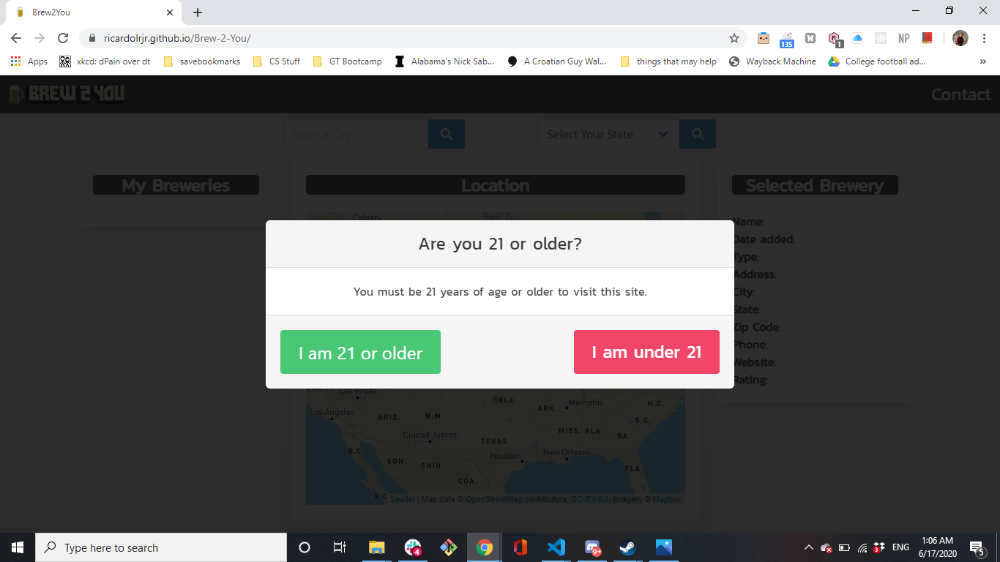
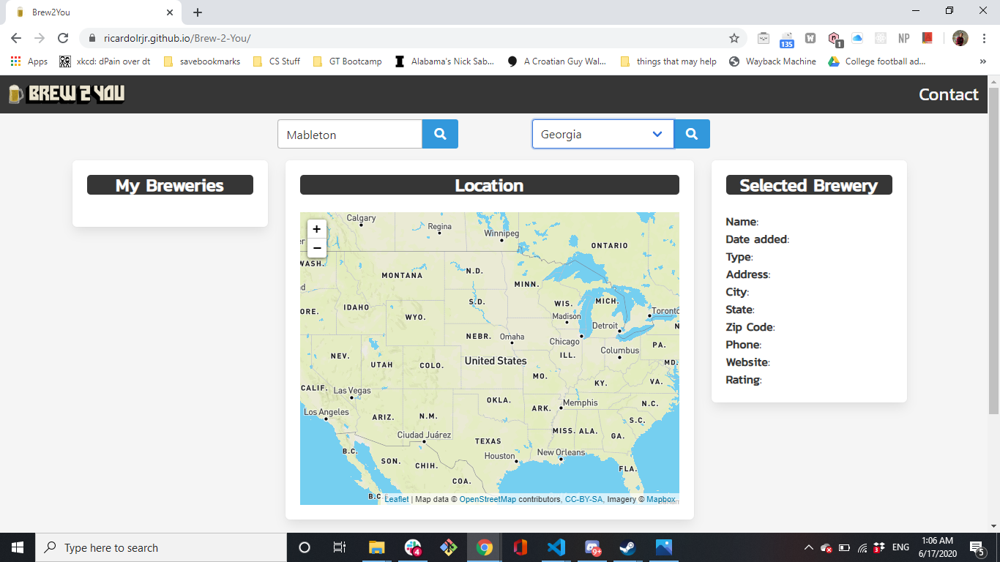
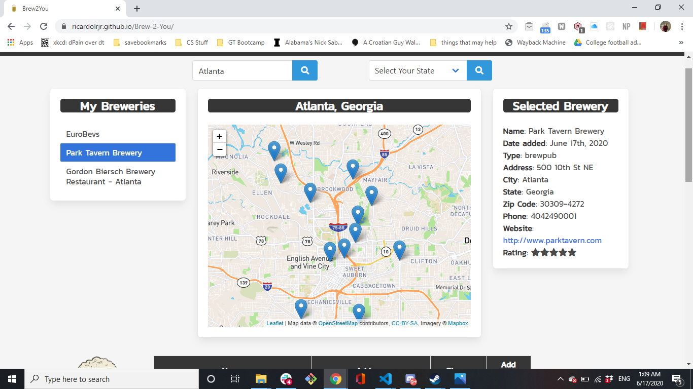
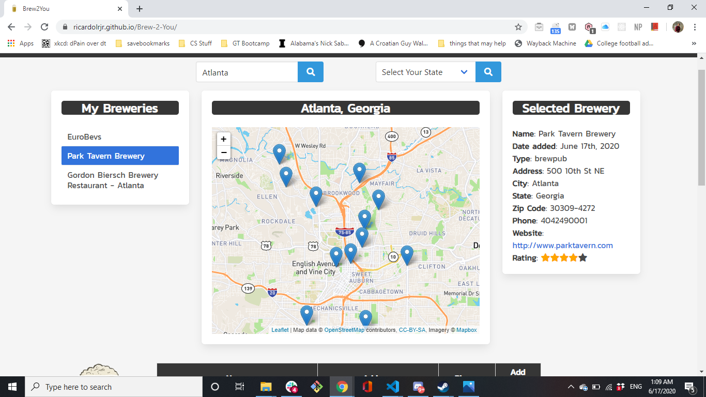
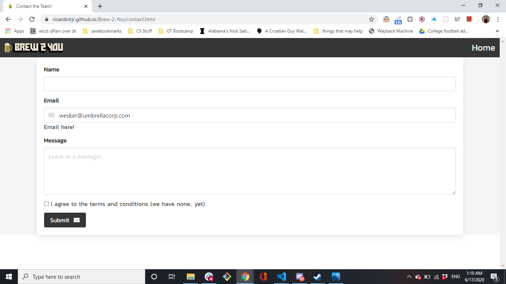

# Brew-2-You
Discover, rate, and go to breweries/beer

# Who made this?
Jessie Everett, Ricardo Russ, and Zack Hayden

# Features:
On page load, the IPinfo.io api will automatically grab the user's location through their IP address.

A splash page that inquires if the user is 21 before allowing them to proceed.

A search function allowing searches using City name and State name as parameters. 

Dynamic generation of a map using the MapBox API for each search result.

Populating the map with pins denoting brewery locations by integrating data returned from the OpenBrewery DB.

For breweries without an address, the ZipCode API is used to approximate location. 

Populating a table with values returned from the OpenBreweryDB using search parameters.

A button to add a selected button to the Previously Saved Breweries list group.

A left-sided list group to display previously saved breweries, which are also saved in local storage.

Once a brewery has been selected from that list, its information is passed to the selected brewery item. 

In the Selected Brewery item, there is a rating system, which allows the user to rate the brewery from 1 - 5 stars

A contact page allowing users to email our official account.

A custom logo displaying our brand identity.

Responsive design using Bulma to ensure user-friendly appearance across all devices. 

## Links

[Github Repository](https://github.com/zackapotamus/Brew-2-You)

[Github hosted page](https://zackapotamus.github.io/Brew-2-You/)

# Future Goals

Add in Uber functionality, when funding has been secured for the project.

Add in functionality for breweries to input the beers they have on tap, and for the user to select the beers they've had.

Add a more consistently updated brewery database than the OpenBreweryDB, to ensure consistent results. 
